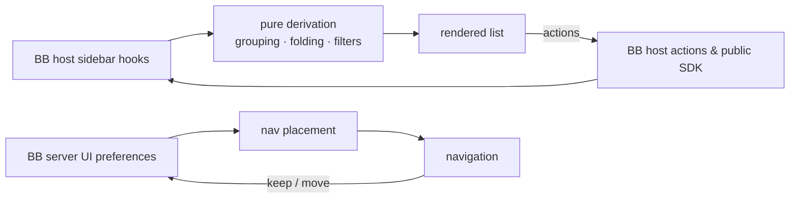

<div align="center">


# Radar Sidebar

### See which of your threads needs you, at a glance.

Radar replaces BB's sidebar thread list and its navigation with a layout built
for people juggling dozens of agent threads at once.<br>
Grouping, folding and attention states do the sorting for you, so nothing that
needs a decision hides at the bottom of the list.


[Features](#features) · [Install](#install) · [How it works](#how-it-works) · [Settings](#settings) · [Development](#development)

<br>


</div>

<br>

> [!NOTE]
> The screenshots are real BB captures populated with fictional demo data.

## The problem

You have forty agent threads open across six projects. Two are waiting for a
decision, one failed twenty minutes ago, and three finished while you were
somewhere else. BB's sidebar sorts them all the same way, so finding the ones
that need you is a manual sweep — and the moment you click a thread to look, it
jumps to the top of "Today" and you lose track of what was actually moving.

Radar is opinionated about the difference between *recent* and *important*.
Activity decides where a thread sits, not when you last opened it. Threads that
need something from you are impossible to miss, and threads that are simply
quiet get out of the way.

|  | Without Radar | With Radar |
| --- | :---: | :---: |
| Tell working from finished without reading | ❌ | ✅ distinct icon, word and colour per state |
| Opening a thread changes its group | ❌ it jumps to Today | ✅ grouping keys off real activity |
| See what a collapsed family is hiding | ❌ | ✅ count, unread rollup and loudest state |
| Spot a thread waiting for your input | ❌ | ✅ amber wash, bar and slow pulse |
| Tell which provider and model a thread runs | ❌ | ✅ icon, model and thinking on the row |
| Arrange the nav once for both surfaces | ❌ | ✅ shared with BB's own sidebar settings |

## Features

<table>
<tr>
<td width="50%" valign="top">

### 🛰️ Activity grouping

Threads group by Today, Yesterday, Previous 7 days, Previous 30 days or Older,
keyed off last *activity* — not last read. A thread you merely opened stays
where it belongs, and anything running or waiting surfaces to Today. Group by
project or section instead with one toggle.

</td>
<td width="50%" valign="top">

### 🔴 Loud attention states

Working, needs-you, failed and finished-unread each get their own icon, status
word, colour and row treatment. Rows that need a decision wash amber or red and
breathe a slow glow; finished-but-unseen threads get a green wash, accent bar
and bold title. Motion is reserved for things that need action, so movement
always means something.

</td>
</tr>
<tr>
<td valign="top">

### 🪢 Nested families

Child threads sit under their parent with indent guides, and the family sorts by
its freshest activity, so a running child floats its parent. Fold a family and
the summary tells you how many are hidden, how many are unseen, and the loudest
state inside.

</td>
<td valign="top">

### 🔎 Hover peek card

Pause on a row for a preview with the thread's original goal, its branch and
pull request, and a stacked context-window meter marked at the auto-compaction
threshold. It is interactive, so you can pin, split or archive from the card.

</td>
</tr>
<tr>
<td valign="top">

### 🧭 Navigation that follows BB

The nav shows inline exactly what you set inline in BB's own "Customize sidebar"
— the same server-synced preferences — and the rest goes under More. Rearrange
in either surface and the other follows.

</td>
<td valign="top">

### ⌨️ Keyboard and bulk control

Arrow keys walk the list, <kbd>Enter</kbd> opens, <kbd>Space</kbd> folds,
<kbd>E</kbd> archives, <kbd>P</kbd> pins and <kbd>X</kbd> selects. Shortcuts
stay out of text fields, open dialogs and menus, and buttons or links outside the
list, so they never steal keys from the rest of BB. <kbd>⌘</kbd>-click or <kbd>⇧</kbd>-click also selects several,
to act on them together from a floating dock. Save a query plus filters as a
named smart view.

</td>
</tr>
</table>

<div align="center">
<table>
<tr>
<td align="center"><br><sub><b>Attention states and nested families</b></sub></td>
<td align="center"><br><sub><b>Hover peek card</b></sub></td>
</tr>
<tr>
<td align="center"><br><sub><b>Grouped by project</b></sub></td>
<td align="center"><br><sub><b>Grouped by section</b></sub></td>
</tr>
<tr>
<td align="center"><br><sub><b>Status chips and a saved smart view</b></sub></td>
<td align="center"><br><sub><b>Multi-select and bulk actions</b></sub></td>
</tr>
<tr>
<td align="center"><br><sub><b>Compact density</b></sub></td>
<td align="center"><br><sub><b>Right-click menu</b></sub></td>
</tr>
<tr>
<td align="center"><br><sub><b>Navigation with More</b></sub></td>
<td align="center"><br><sub><b>Plugin settings</b></sub></td>
</tr>
</table>
</div>

## Install

```sh
bb plugin install 'git:https://github.com/MacHatter1/bb-plugin-radar-sidebar.git@^0.1.0' --yes
```

The Git semver range tracks compatible `v0.1.x` releases.

Then pick it in **Settings → Appearance**: choose **Radar** for the sidebar and
**Radar navigation** for the controls above it.

<details>
<summary><b>Install from a local clone</b></summary>

```sh
git clone https://github.com/MacHatter1/bb-plugin-radar-sidebar
cd bb-plugin-radar-sidebar
npm install && bb plugin build
bb plugin install path:$PWD --yes
```

</details>

**Requirements**

- bb **0.43+** (Plugin SDK 0.5.9+)

## Where to find it

| Where | What |
| --- | --- |
| **Sidebar thread list** | Grouped, folded, attention-coloured threads with a filter, status chips, grouping and density toggles, and expand/collapse all. |
| **Smart views bar** | Saved query-plus-filter presets, and a shortcut to save the current one. |
| **Navigation above the list** | New thread, your inline destinations, and More for the rest. |
| **Row hover** | Pin, rename, archive and a fuller menu; a peek card after a short pause. |
| **Settings → Appearance** | Choose Radar for the thread list and the navigation. |

## How it works



- **Reads BB's live state, owns none of it.** Threads, projects and sections
  come from the host's sidebar hooks; pins, reads, renames and archives route
  through BB's own actions, so optimistic updates, confirmations and toasts
  behave exactly as they do in the stock list.
- **Derivation stays out of the components.** Grouping, tree building and
  filter matching live in one hook, `useThreadGroups`, and time bucketing and
  nav placement are plain functions with no React, so the rows only render.
- **Model info is fetched, then cached per window.** The options endpoint
  resolves *defaults*, so model and thinking are shown only while a thread is
  actually in flight. Remounts within the same run reuse cached values;
  new activity, a restart or window focus triggers a refresh.
- **Nav placement is shared, not mirrored.** Radar reads and writes BB's
  `sidebar.pluginPanelOrder` and `sidebar.visiblePluginPanels` preferences
  using the same merge rules the stock sidebar applies.
- **It will not move a thread between projects.** BB's thread API exposes no
  `projectId` on update, so project grouping is view-only; drag-to-organise
  files threads into sections, which BB does allow.

## Privacy

- 🛰️ **Nothing leaves the machine.** Radar makes no network requests of its own;
  every read and write goes to your BB server through the plugin SDK.
- 🧾 **No storage of its own.** No database, no files. Preferences live in
  browser `localStorage`, except nav placement, which is BB's own synced state.
- 🔒 **No secrets.** The plugin defines no secret settings and reads none.

## Settings

`bb plugin config radar-sidebar`, or **Settings → Installed plugins → Radar Sidebar**.

<details>
<summary><b>All settings</b></summary>

| Setting | Default | |
| --- | --- | --- |
| `hoverCard` | `true` | Show the hover peek card. |
| `celebrate` | `true` | Pop the check badge once when a thread finishes. |
| `motion` | `true` | Pulse rows that need input or have failed. Also respects `prefers-reduced-motion`. |
| `loudUnread` | `true` | Wash and accent bar on finished-but-unseen threads. Off keeps the icon and pip only. |
| `adaptiveCollapse` | `true` | Fold quiet read-idle rows down to title, project and time. |
| `defaultDensity` | `"comfortable"` | `comfortable` or `compact`. Applies until you change density in the header, which is remembered per client. |

</details>

<details>
<summary><b>Turning it off</b></summary>

```sh
bb plugin disable radar-sidebar
bb plugin enable radar-sidebar
```

`bb plugin remove radar-sidebar` removes the plugin and its settings. Disabling
it returns the sidebar to BB's own list immediately.

</details>

## Development

```sh
npm install
npm test
npm run typecheck
bb plugin build
bb plugin install path:$PWD --yes
bb plugin dev                      # rebuild and reload on every save
```

```
server.ts               the six settings the frontend reads; no storage, no CLI
app.tsx                 registers the thread-list and navigation slots
app.css                 styles on BB theme tokens, behind the radar- prefix
components/radar/       the list, rows, nav, menus, peek card and smart views
components/radar/*.ts   grouping hook, time bucketing, nav placement, model cache
components/storage.ts   one-time migration of codex-sidebar: preferences
components/ui/          vendored BB UI primitives
skills/                 the bundled agent skill
assets/icon.svg         the plugin icon BB shows (bb.branding.icon)
docs/                   logo and screenshots
```

**Tests** cover time bucketing and nav placement as plain functions, the
rendered list through BB's plugin test harness (`renderSlot` with seeded
sidebar threads), saved-view validation, preference migration, execution-cache
refreshes and completion timers. Static guards over `app.css` cover cascade
mistakes jsdom cannot reproduce.

`PLUGIN_OVERVIEW.md` is the store listing. Keep it in step with
`bb.description` in `package.json`.

## Licence

[MIT](LICENSE)
