<div align="center">


# Radar Sidebar

### See which of your threads needs you, at a glance.

Radar replaces BB's sidebar thread list and its navigation with a layout built
for people juggling dozens of agent threads at once.<br>
Grouping, folding and attention states do the sorting for you, so nothing that
needs a decision hides at the bottom of the list.


[Features](#features) · [Install](#install) · [Navigation rail](#navigation-rail) · [How it works](#how-it-works) · [Settings](#settings) · [Development](#development)

<br>

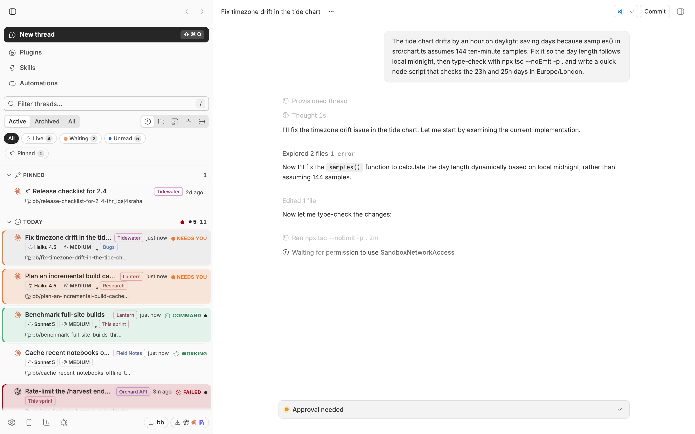

</div>

<br>

> [!NOTE]
> The screenshots are real BB captures populated with fictional demo data.

## The problem

You have forty agent threads open across six projects. Two are waiting for a
decision, one failed twenty minutes ago, and three finished while you were
somewhere else. BB's sidebar sorts them all the same way, so finding the ones
that need you is a manual sweep — and the moment you click a thread to look, it
jumps to the top of "Today" and you lose track of what was actually moving.

Radar is opinionated about the difference between *recent* and *important*.
Activity decides where a thread sits, not when you last opened it. Threads that
need something from you are impossible to miss, and threads that are simply
quiet get out of the way.

|  | Without Radar | With Radar |
| --- | :---: | :---: |
| Tell working from finished without reading | ❌ | ✅ distinct icon, word and colour per state |
| Opening a thread changes its group | ❌ it jumps to Today | ✅ grouping keys off real activity |
| See what a collapsed family is hiding | ❌ | ✅ count, unread rollup and loudest state |
| Spot a thread waiting for your input | ❌ | ✅ amber wash, bar and slow pulse |
| Tell which provider and model a thread runs | ❌ | ✅ icon, model and thinking on the row |
| Arrange the nav once for both surfaces | ❌ | ✅ shared with BB's own sidebar settings |

## Features

<table>
<tr>
<td width="50%" valign="top">

### 🛰️ Activity grouping

Threads group by Today, Yesterday, Previous 7 days, Previous 30 days or Older,
keyed off last *activity* — not last read. A thread you merely opened stays
where it belongs, and anything running or waiting surfaces to Today. Group by
project or section instead with one toggle. In section view, choose **New
section**, enter a name, then **Create section**. Drag threads onto its header
or use **Move to section** in a thread's right-click menu.

</td>
<td width="50%" valign="top">

### 🔴 Loud attention states

Working, needs-you, failed and finished-unread each get their own icon, status
word, colour and row treatment. Rows that need a decision wash amber or red and
breathe a slow glow; finished-but-unseen threads get a green wash, accent bar
and bold title. Motion is reserved for things that need action, so movement
always means something.

Queued messages scheduled for a future time show a calm clock and **Scheduled**,
with the local run time in the tooltip. Folded families and group headers keep
that distinction. Threads with immediate queued work still show **Queued**.
The project rail uses a static clock badge for scheduled work, excluding it
from the pulsing waiting count and the spinning working count.

</td>
</tr>
<tr>
<td valign="top">

### 🪢 Nested families

Child threads sit under their parent with indent guides, and the family sorts by
its freshest activity, so a running child floats its parent. Fold a family and
the summary tells you how many are hidden, how many are unseen, and the loudest
state inside.

</td>
<td valign="top">

### 🔎 Hover peek card

Pause on a row for a preview with the thread's original goal, its branch and
pull request, and a stacked context-window meter marked at the auto-compaction
threshold. It is interactive, so you can pin, split or archive from the card.

</td>
</tr>
<tr>
<td valign="top">

### 🧭 Navigation that follows BB

The nav shows inline exactly what you set inline in BB's own "Customize sidebar"
— the same server-synced preferences — and the rest goes under More. Rearrange
in either surface and the other follows.

</td>
<td valign="top">

### ⌨️ Keyboard and bulk control

Arrow keys walk the list, <kbd>Enter</kbd> opens, <kbd>Space</kbd> folds,
<kbd>E</kbd> archives, <kbd>P</kbd> pins and <kbd>X</kbd> selects. Shortcuts
stay out of text fields, open dialogs and menus, and buttons or links outside the
list, so they never steal keys from the rest of BB. <kbd>⌘</kbd>-click or <kbd>⇧</kbd>-click also selects several,
to act on them together from a floating dock. Save a query plus filters as a
named smart view. Swipe a row, by touch or with two fingers on a trackpad,
to mark it read or archive it; each direction's action is a setting.

</td>
</tr>
</table>

<div align="center">
<table>
<tr>
<td align="center">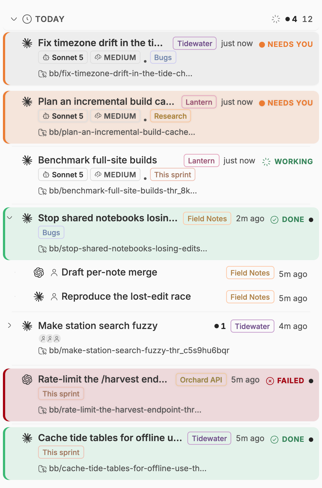<br><sub><b>Attention states and nested families</b></sub></td>
<td align="center">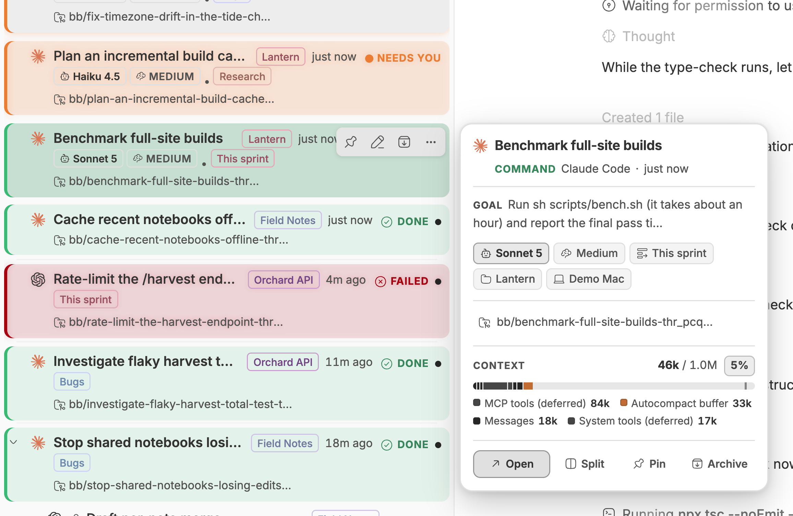<br><sub><b>Hover peek card</b></sub></td>
</tr>
<tr>
<td align="center">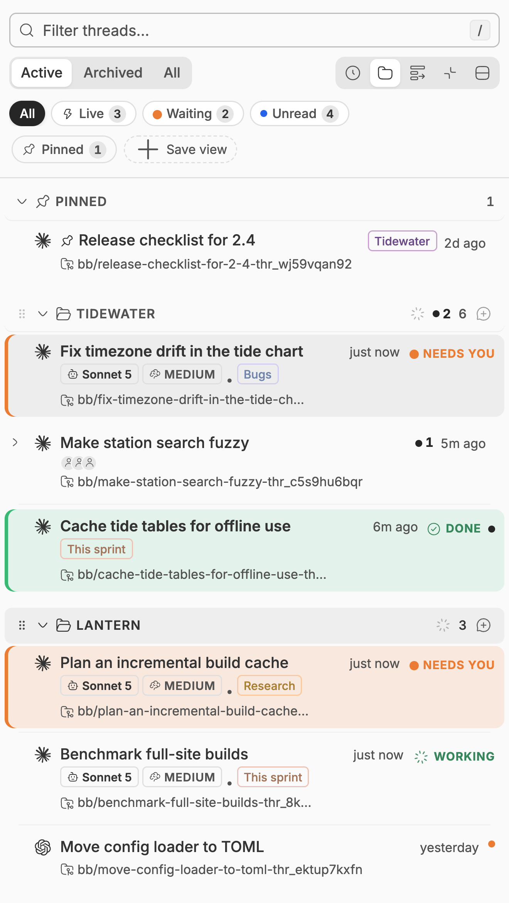<br><sub><b>Grouped by project</b></sub></td>
<td align="center">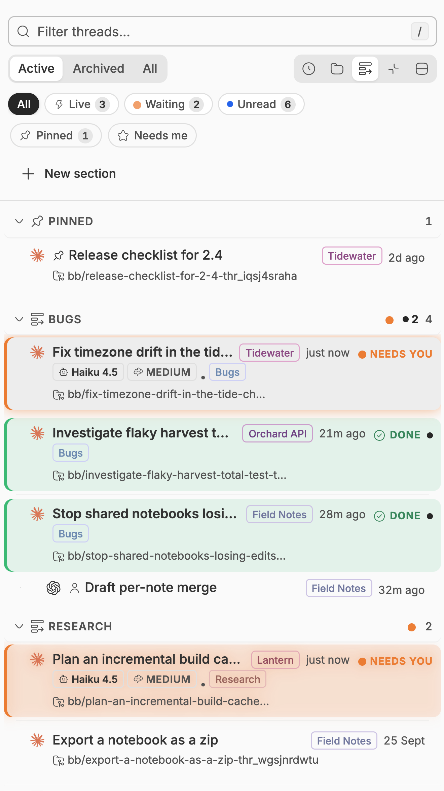<br><sub><b>Grouped by section</b></sub></td>
</tr>
<tr>
<td align="center">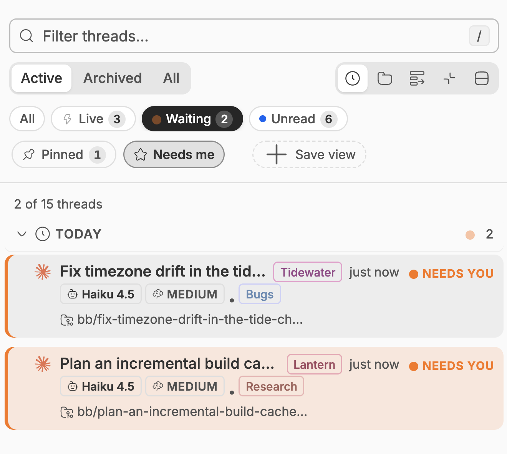<br><sub><b>Status chips and a saved smart view</b></sub></td>
<td align="center">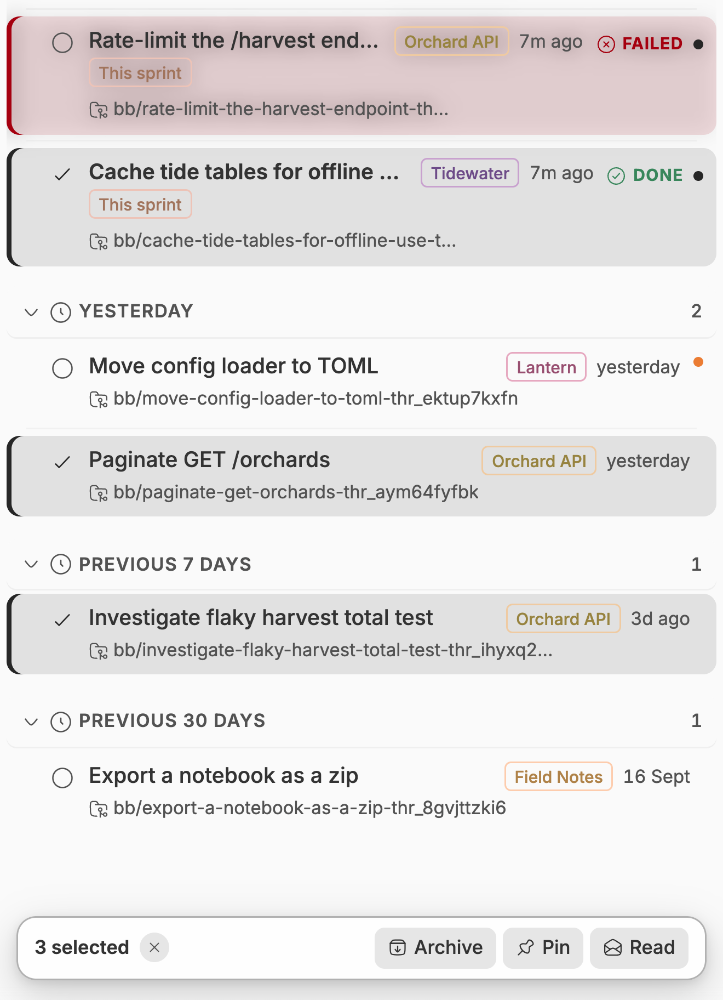<br><sub><b>Multi-select and bulk actions</b></sub></td>
</tr>
<tr>
<td align="center">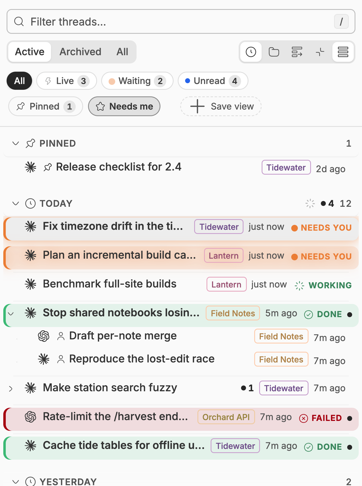<br><sub><b>Compact density</b></sub></td>
<td align="center">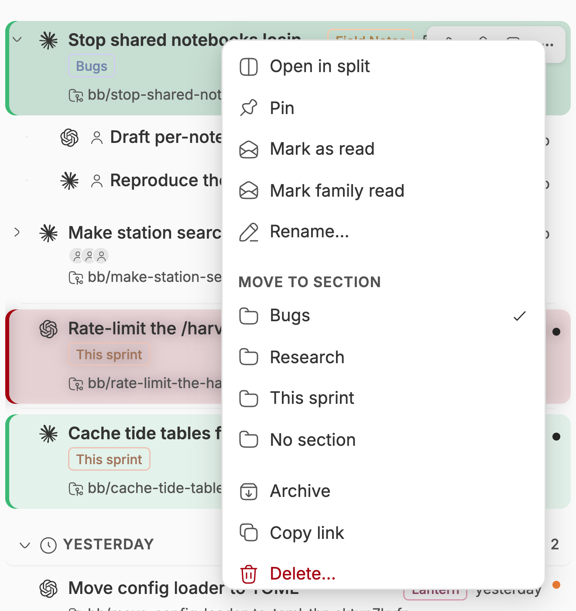<br><sub><b>Right-click menu</b></sub></td>
</tr>
<tr>
<td align="center">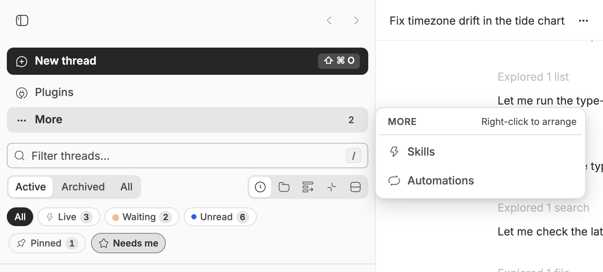<br><sub><b>Navigation with More</b></sub></td>
<td align="center">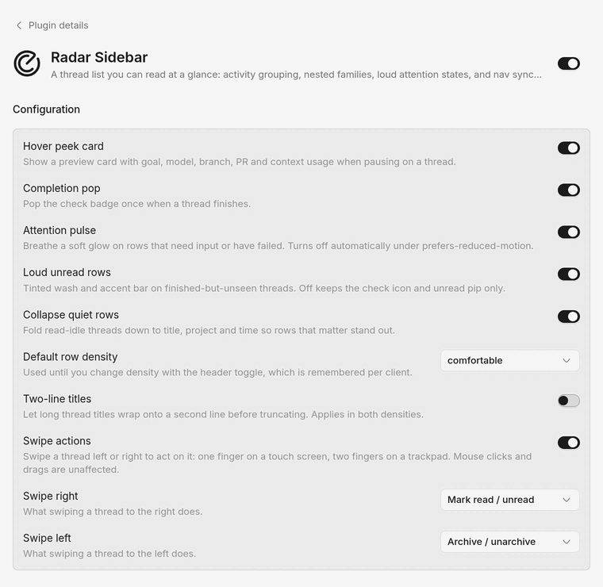<br><sub><b>Plugin settings</b></sub></td>
</tr>
</table>
</div>

## Install

```sh
bb plugin install 'git:https://github.com/MacHatter1/bb-plugin-radar-sidebar.git@^0.5.2' --yes
```

The Git semver range tracks compatible `v0.5.x` releases. If you installed
an earlier minor series, rerun this command to move to the new range.

Then pick it in **Settings → Appearance**: choose **Radar** for the sidebar and
**Radar navigation** for the controls above it.

<details>
<summary><b>Install from a local clone</b></summary>

```sh
git clone https://github.com/MacHatter1/bb-plugin-radar-sidebar
cd bb-plugin-radar-sidebar
npm install && bb plugin build
bb plugin install path:$PWD --yes
```

</details>

**Requirements**

- bb **0.44+** (Plugin SDK 0.5.29+)

## Where to find it

| Where | What |
| --- | --- |
| **Sidebar thread list** | Grouped, folded, attention-coloured threads with a filter, status chips, grouping and density toggles, and expand/collapse all. |
| **Smart views bar** | Saved query-plus-filter presets, and a shortcut to save the current one. |
| **Navigation above the list** | New thread, your inline destinations, and More for the rest. |
| **Row hover** | Pin, rename, archive and a fuller menu; a peek card after a short pause. |
| **Settings → Appearance** | Choose Radar for the thread list and the navigation. |

## Navigation rail

Enable **Navigation rail** (`railNav`) under Settings → Installed plugins →
Radar Sidebar. It defaults off: navigation remains above the list, including
the touch toolbar, until you enable it. Under Appearance, choose **Radar** for Sidebar and
**Radar navigation** for Navigation, both supplied by Radar Sidebar.

On desktop a 60px icon rail sits beside the thread list. It follows BB's
saved navigation order and visibility: visible destinations inline, hidden
ones in **More** (with a count on the icon), **Customize sidebar** at the
foot. BB's own footer controls (Settings, Mobile apps, usage, Report a bug,
updates, account) keep their default bottom bar under the thread list, to
the right of the rail, on a tonal bar with the rail's exact control
metrics (42px boxes, 20px icons, matching hover). Below 768px the same rail (56px) runs down the left of
BB's mobile drawer with the thread list beside it, like a chat app's
server rail. Tooltips
and the labelled rail are desktop-only. Resize the sidebar with BB's normal
handle to give the thread list more room.

Right-click a plugin destination with a live accessory to choose **Live status**:
**Off (dot indicator)** keeps the static icon and status dot (the default),
**As a badge** shows the accessory in a clipped 16×16px box at the icon's bottom
trailing corner, and **Instead of the icon** centres it in a clipped 28×28px
square. The choice is saved per navigation item in `railLiveStatus` and shared
across devices. Accessories are decorative and isolated by error boundaries;
if one fails, its static icon remains. Tooltips, More and standard navigation
also show live accessories, clipped to the host's 4rem by 1.25rem slot.

<details>
<summary><b>Project scope, tooltips, keyboard and more</b></summary>

- **Pinned projects.** Right-click a project tile and choose **Pin project**
  to keep it at the top of the rail, even when it has no visible threads.
  A small pin marks it. Choose **Unpin project** to return it to the usual
  activity order. Drag pinned tiles to choose their order; with a keyboard,
  press Space, use the arrow keys, then Space to drop (Escape cancels).
  **Move pin up / down** in the menu also works. Pins and their order are
  saved across reloads and shared across devices.
- **Project collections.** Choose **Move to collection…** in a project's
  right-click menu to create or select a collection. Click its header to
  collapse or expand it; right-click the header to rename or remove it.
  Collected projects remain visible without active threads. Pins stay above
  collections and return to their collection when unpinned. Removing a
  collection returns its projects to the normal rail.
- **Project quick actions.** **New thread in project** starts a thread in
  that project without changing your current rail filter. In the desktop
  app, the menu discovers installed editor and terminal apps and offers
  **Open in…** actions for the project's checkout on the viewing computer.
- **Mark project as read.** Clears the chosen project's currently unread
  threads, leaving other projects and later incoming updates alone. Partial
  failures are reported so you can retry.
- **Open in Finder.** In BB's macOS desktop app, right-click a project tile
  and choose **Open in Finder** to open its checkout on that Mac. The action
  uses the project's local source, preferring its default local checkout.
  Projects without a folder on that Mac show an explanatory message.
- **Project scope.** Below the destinations, every project with an active
  thread gets a coloured monogram tile, most recently active first (a project
  with a thread waiting on you stays on top until you've dealt with it), with
  count badges: a solid amber count with a pulsing halo for threads waiting
  on you (top right), a green count in a spinning ring for work in progress
  (top left), and the theme's primary colour for unread (bottom right). Wide
  mode lines them up at the end of the row. Turn the badges, and the
  needs-you ordering, off with **Project badges** (`projectBadges`, on by
  default with the rail). **Project style** (`projectStyle`, Tiles by default)
  redraws the projects as Rings (state in the ring: amber glow, working arc)
  or Chips (pills edged by the loudest state); wide rows keep the full end
  counts in every style. Click a tile and the thread list shows only that
  project, its heading becomes the project name, and the tile fills with its
  colour. Click it again, the heading, or
  Home to see every project. Home only clears the filter; **New thread** in
  the heading starts the thread in the scoped project (Option-click opens a
  split instead, without the project preset). Tooltips carry the tally ("4 threads ·
  1 waiting · 2 live"). Live and waiting counts follow the thread list's
  rules, including background and queued work. Remembered per client. A
  project with only archived threads keeps its scope and clear heading;
  deleted projects clear once the project directory has loaded. If you
  choose another navigation provider while keeping this thread list, a
  project filter button above Search lets you return to every project. Turning
  `railNav` off shows all projects while preserving the choice for next time.
- **Tooltips.** Pause on a rail icon (or focus it from the keyboard) for
  the destination's name, its shortcut as a key cap, and the panel's
  accessory that the icon can't fit; a dot on the icon marks that an
  accessory exists.
- **Active pill.** The current destination gets a primary-coloured bar on
  the rail's edge, so it reads without colour.
- **Keyboard.** Arrow keys step through the rail and wrap; Home/End jump to
  the ends. Same inside the More popover.
- **Right-click to arrange.** *Move to More* / *Keep in sidebar*, *Move up*
  / *Move down* (saved to BB's own order, so Customize sidebar agrees),
  *Open in split*, and *Plugin details* for plugin panels.
- **Customize beside the rail.** BB's arrangement editor opens as a panel
  next to the rail with the rail still visible, so reordering and hiding
  items is reflected live where they sit.
- **Short windows.** The rail scrolls internally with a position indicator,
  so destinations stay reachable on small screens while Customize stays
  pinned at the foot.
- **Status chips fold** to glyph and count when the list is 284px or less,
  so the filter row stays on one line.
- **Mobile heading controls** keep 44px touch targets, and the scoped
  project heading always shows its clear icon.

</details>

<p align="center">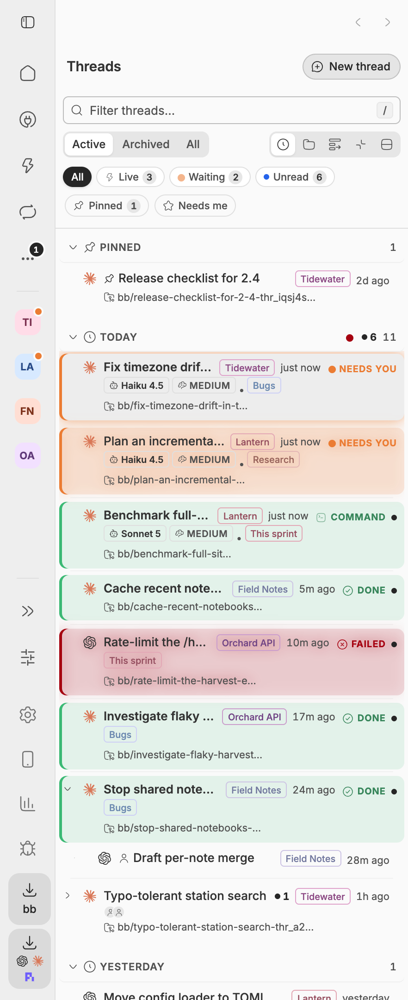</p>

### Labelled rail (experimental, off by default)

Settings → Installed plugins → Radar Sidebar → **Labelled rail**
(`wideRail`) requires Navigation rail and adds a double-chevron toggle at the foot of the rail. On, the rail widens to 168px
with labels, the sidebar grows by the same amount so the thread list keeps
its width. The choice is
remembered per client.

This restyles BB's sidebar markup (its `data-sidebar` attributes and the
sidebar width variable), which is why it ships off: a BB update that changes that markup
can break it. The plugin checks for the structure it needs and hides the
toggle when it is missing, so the worst case is a narrow rail, not a broken
sidebar. This integration was live-checked on BB 0.45.1 nightly, with tests
and typechecking against SDK 0.5.29. Earlier rail prototypes were checked
on BB 0.44.1 and 0.45.0; those runtimes have not been rerun for this integration.

<div align="center">
<table>
<tr>
<td align="center">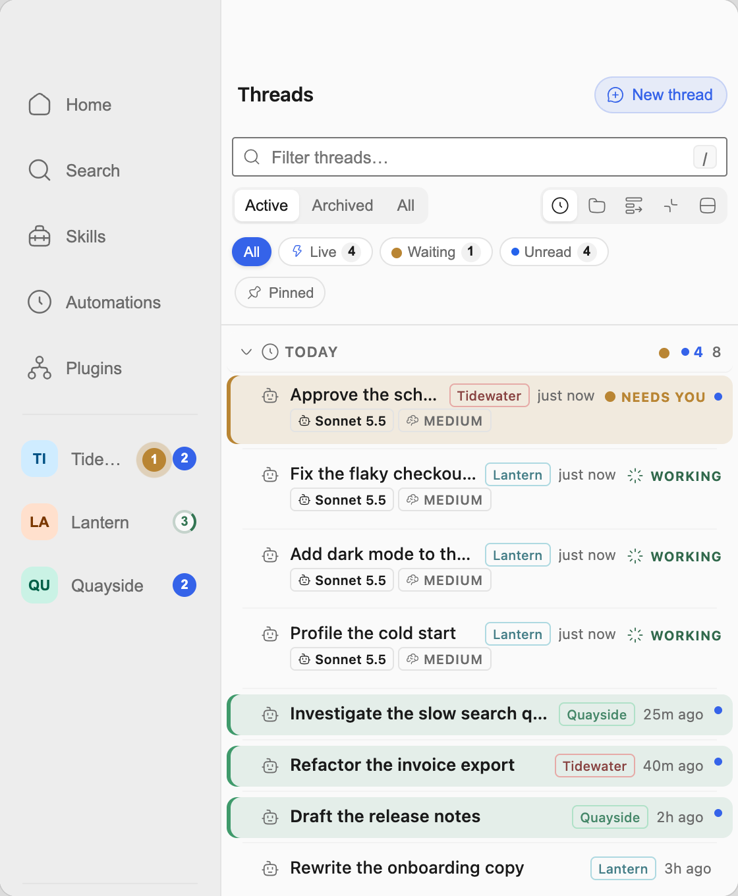<br><sub><b>Labelled rail</b></sub></td>
<td align="center">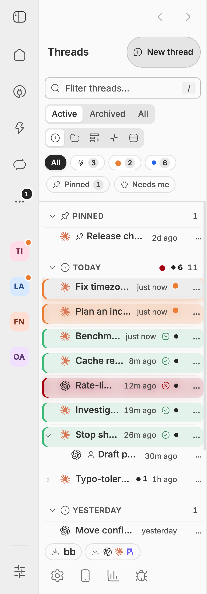<br><sub><b>Mobile drawer</b></sub></td>
</tr>
</table>
</div>

## Compatibility notes

The gutter, footer surface and Customize editor use BB's `data-sidebar` DOM
attributes. The rail renders those overrides as a `<style>` element in its
own markup (`components/radar/railHostStyles.ts`), so they exist only
while it is mounted and it never writes to BB's elements. It doesn't use
`:has()`: anchored on the page or the sidebar, it made the browser restyle
the whole page on every DOM change in BB. If a future BB shell changes
those attributes, the rail still renders but the gutter may need a
selector update. Nothing here touches BB's data: thread operations go through the
public SDK, navigation order through `setOrder`/`setVisible`, and client
state lives under `radar-sidebar:*` localStorage keys.

## How it works

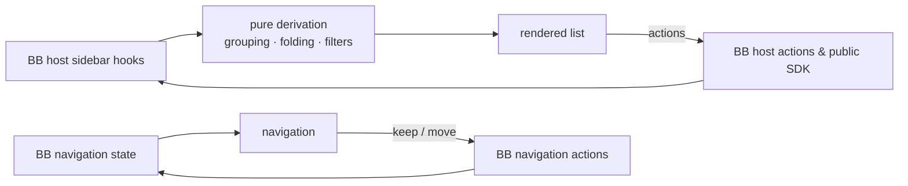

- **Reads BB's live state, owns none of it.** Threads, projects and sections
  come from the host's sidebar hooks; pins, reads, renames and archives route
  through BB's own actions, so optimistic updates, confirmations and toasts
  behave exactly as they do in the stock list.
- **Derivation stays out of the components.** Grouping, tree building and
  filter matching live in one hook, `useThreadGroups`, and time bucketing is
  a plain function with no React, so the rows only render.
- **Model info is fetched, then cached per window.** The options endpoint
  resolves *defaults*, so model and thinking are shown only while a thread is
  actually in flight. Remounts within the same run reuse cached values;
  new activity, a restart or window focus triggers a refresh.
- **Nav placement is shared, not mirrored.** BB's navigation hook supplies
  the saved order and visibility. Radar passes visibility changes to its
  host actions, which own preference saves and updates.
- **It will not move a thread between projects.** BB's thread API exposes no
  `projectId` on update, so project grouping is view-only; drag-to-organise
  files threads into sections, which BB does allow.

## Privacy

- 🛰️ **No third-party requests.** Radar sends reads and writes only to your BB
  server through the plugin SDK; it contacts no external service.
- 🧾 **Preferences only.** Shared plugin settings live in BB's plugin KV storage.
  Browser `localStorage` holds a first-paint cache and per-client view choices;
  nav placement is BB's own synced state. Radar creates no separate database.
- 🔒 **No secrets.** The plugin defines no secret settings and reads none.

## Settings

Open **Settings → Installed plugins → Radar Sidebar**. The plugin keeps its own
settings, shared by every device you use, so they don't appear in
`bb plugin config`.

The settings page groups everything into four cards: Navigation rail, Thread
rows, Attention and feedback, and Swipe actions. Each card has a small live
picture that changes as you flip its switches, and options that depend on
another (Labelled rail and Project badges need Navigation rail; the swipe
actions need Swipe actions) are greyed out with a note until that one is on.

<details>
<summary><b>All settings</b></summary>

| Setting | Default | |
| --- | --- | --- |
| `railNav` | `false` | Navigation rail with project filters beside the thread list. |
| `pinnedProjects` | `{}` | Projects kept at the top of the rail, chosen with Pin project / Unpin project in a project's right-click menu; shared across devices. |
| `projectOrganisation` | Empty order and collections | Saved pin order, named collections, collapse state and project membership; edited in the rail and shared across devices. |
| `wideRail` | `false` | Experimental labelled desktop rail; requires `railNav`. |
| `railLiveStatus` | `{}` | Per-item live accessory placement (`off`, `badge`, `icon`), chosen by right-clicking a rail destination or More row. |
| `projectBadges` | `true` | Needs-you, working and unread badges on the rail's project tiles, and projects that need you kept on top; requires `railNav`. |
| `projectStyle` | `"Tiles"` | How rail projects look: `Tiles`, `Rings` or `Chips`; requires `railNav`. |
| `hoverCard` | `true` | Show the hover peek card. |
| `celebrate` | `true` | Pop the check badge once when a thread finishes. |
| `motion` | `true` | Pulse rows that need input or have failed. Also respects `prefers-reduced-motion`. |
| `loudUnread` | `true` | Wash and accent bar on finished-but-unseen threads. Off keeps the icon and pip only. |
| `adaptiveCollapse` | `true` | Fold quiet read-idle rows down to title, project and time. |
| `defaultDensity` | `"comfortable"` | `comfortable` or `compact`. Applies until you change density in the header, which is remembered per client. |
| `twoLineTitles` | `false` | Enable **Two-line titles** to wrap long titles, including mentions, before truncating. Short titles keep their project chip and time beside them when they fit; otherwise metadata wraps below, aligned with the title text. Applies in both densities. |
| `swipeActions` | `true` | Swipe a row left or right to act on it: one finger on a touch screen, two fingers on a trackpad. A trackpad swipe stopped short rests open with its action as a button. A mouse's clicks, drags and Shift+wheel are unaffected. |
| `swipeRight` | `"Mark read / unread"` | Action for a rightward swipe: `Mark read / unread`, `Pin / unpin`, `Archive / unarchive`, `Open in split`, `Rename`, `More actions`, `Delete…` (BB confirms) or `Nothing`. |
| `swipeLeft` | `"Archive / unarchive"` | Action for a leftward swipe, from the same list. |

The list never waits on settings: until they load it uses the defaults above,
except that `defaultDensity` and `twoLineTitles` use the value this client last
saw, so rows paint at their final height. In two-line mode, hover actions sit
on the row's last line of plain text (the subtitle, or the project chip and
time where the subtitle is folded away), so they stay off a wrapped title and
off the PR badge. A row that is only one line tall still has them over the end
of its title, as in one-line mode. They never change the row's layout.

</details>

<details>
<summary><b>Turning it off</b></summary>

```sh
bb plugin disable radar-sidebar
bb plugin enable radar-sidebar
```

`bb plugin remove radar-sidebar` removes the plugin and its settings. Disabling
it returns the sidebar to BB's own list immediately.

</details>

## Development

```sh
npm install
npm test
npm run typecheck
bb plugin build
bb plugin install path:$PWD --yes
bb plugin dev                      # rebuild and reload on every save
```

```
server.ts               shared settings in plugin KV storage; RPC and realtime, no CLI
app.tsx                 registers the thread-list and navigation slots
app.css                 styles on BB theme tokens, behind the radar- prefix
components/radar/       the list, rows, nav, menus, peek card and smart views
components/radar/*.ts   grouping hook, time bucketing, nav placement, model cache,
                        and the styles the rail applies to BB's sidebar while mounted
lib/settingsRpc.ts      versioned settings snapshots and atomic per-item edits
lib/swipe.ts            swipe actions and gesture math
components/storage.ts   one-time migration of codex-sidebar: preferences
components/ui/          vendored BB UI primitives
skills/                 the bundled agent skill
assets/icon.svg         the plugin icon BB shows (bb.branding.icon)
docs/                   logo and screenshots
```

**Tests** cover time bucketing and nav placement as plain functions, the
rendered list through BB's plugin test harness (`renderSlot` with seeded
sidebar threads), saved-view validation, preference migration, execution-cache
refreshes, completion timers, and render counts, so a sidebar update re-renders
only the rows that changed. Settings tests cover pending edits, stale snapshots,
reconnection and concurrent accessory changes; interaction regressions cover
complete pointer clicks, IME composition and folded queued work.
Static guards over `app.css` and the rail's host
stylesheet cover cascade mistakes jsdom cannot reproduce.
The test setup uses jsdom's `localStorage` explicitly, including on Node 26,
whose native storage global otherwise shadows it without a backing file.

`PLUGIN_OVERVIEW.md` is the store listing. Keep it in step with
`bb.description` in `package.json`.

## Licence

[MIT](LICENSE)
